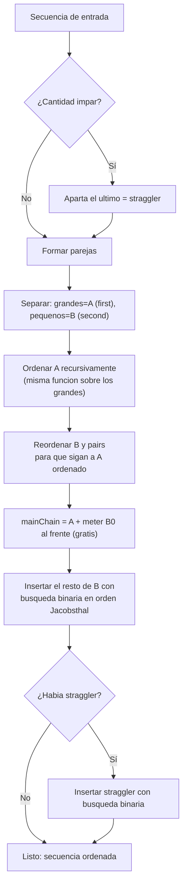

# Chuleta PmergeMe (Ford-Johnson "purista") — versión deque

Esta es la versión **completa/fiel** de Ford-Johnson (merge-insertion sort). Más larga que la simple, pero óptima en número de comparaciones. Aquí tienes todo para defenderla sin quedarte en blanco.

---

## 1. La idea en 1 frase

> "Comparo los números **de dos en dos**, ordeno solo a los **ganadores**, y luego **inserto a los perdedores** en el sitio justo usando búsqueda binaria, en un orden especial (Jacobsthal) que ahorra comparaciones."

---

## 2. El vocabulario (apréndetelo, te lo preguntan)

| Término | Qué es | En el código |
|---|---|---|
| **Pareja (pair)** | dos números comparados entre sí | `std::pair<int,int>` |
| **A / grandes** | el **mayor** de cada pareja (`first`) | `ANumbers` |
| **B / pequeños** | el **menor** de cada pareja (`second`) | `BNumbers` |
| **Cadena principal (main chain)** | la lista que vamos construyendo ordenada | `mainChain` |
| **Suelto (straggler)** | el último elemento si la cantidad es impar | `pendingImpar` |
| **Jacobsthal** | la serie 0,1,1,3,5,11... que da el **orden de inserción** | `createJacobsthalSequence` |

---

## 3. Diagrama del flujo completo



---

## 4. Las 6 fases explicadas (con el "por qué")

### Fase 1 — Apartar el suelto
Si hay un número impar de elementos, el último no tiene pareja. Lo guardamos para el final.

```cpp
if (sequence.size() % 2 != 0)
{
    pendingImpar = sequence.back();
    sequence.pop_back();
}
```

### Fase 2 — Formar parejas (grande, pequeño)
Cogemos de dos en dos. En cada pareja, el grande va a `first` y el pequeño a `second`.

```cpp
if (num1 > num2)
    pairs.push_back(std::make_pair(num1, num2)); // (grande, pequeño)
else
    pairs.push_back(std::make_pair(num2, num1));
```

### Fase 3 — Ordenar solo los grandes (RECURSIÓN)
> **El truco del algoritmo.** Solo ordenamos los grandes (`A`). ¿Por qué? Porque si los grandes ya están ordenados, sé que cada pequeño es **más pequeño que su propio grande**, así que cada pequeño solo puede ir "a la izquierda" de su pareja. Eso me limita dónde buscar.

```cpp
fordJohnsonVector(ANumbers);   // llamada recursiva sobre los grandes
```

### Fase 4 — Reordenar B para que siga a A (¡la parte que más confunde!)
Cuando ordeno `A`, los grandes cambian de orden. Pero `B` se queda en el orden viejo → **se rompe el emparejamiento**. Hay que volver a alinear cada pequeño con su grande.

```
ANTES (A sin ordenar):  A=[12, 9, 15]   B=[3, 7, 2]   pairs=(12,3)(9,7)(15,2)
Ordeno A:               A=[9, 12, 15]
Reordeno B y pairs:     B=[7, 3, 2]      pairs=(9,7)(12,3)(15,2)
```

> Frase para la defensa: *"al ordenar los grandes pierdo el emparejamiento, así que reordeno los pequeños para que cada uno vuelva a quedar pegado a su grande."*

```cpp
reorderBNumbersAndPairs(ANumbers, BNumbers, pairs);
```

### Fase 5 — Construir la cadena e insertar
1. La cadena empieza siendo los grandes ya ordenados: `mainChain = A`.
2. **El primer pequeño (`B[0]`) entra GRATIS al principio.** Es el pequeño del grande más pequeño, así que es el menor de todos → va al frente sin comparar.

```cpp
std::vector<int> mainChain = ANumbers;
if (!BNumbers.empty())
    mainChain.insert(mainChain.begin(), BNumbers[0]);  // gratis
```

3. El resto de pequeños se insertan **en orden de Jacobsthal** y con **búsqueda binaria acotada**:

```cpp
std::vector<int>::iterator posLimit =
    std::find(mainChain.begin(), mainChain.end(), targetNumLarger); // su pareja grande
std::vector<int>::iterator insertPos =
    binarySearchInsertPos(mainChain.begin(), posLimit, valueToInsert); // busco SOLO hasta su grande
mainChain.insert(insertPos, valueToInsert);
```

> **¿Por qué buscar solo hasta su pareja (`posLimit`)?** Porque sé que el pequeño es menor que su grande → nunca irá a la derecha de él. Acotar la búsqueda ahorra comparaciones.

### Fase 6 — Insertar el suelto
Por último, el straggler se inserta con búsqueda binaria en toda la cadena.

```cpp
if (pendingImpar >= 0)
{
    std::vector<int>::iterator insertPos =
        binarySearchInsertPos(mainChain.begin(), mainChain.end(), pendingImpar);
    mainChain.insert(insertPos, pendingImpar);
}
```

---

## 5. EJEMPLO TRAZADO COMPLETO: `[3, 5, 9, 7, 4]`

```
ENTRADA: [3, 5, 9, 7, 4]
```

**Fase 1 — Suelto:** son 5 (impar) → aparto el último.
```
straggler = 4        sequence = [3, 5, 9, 7]
```

**Fase 2 — Parejas (grande, pequeño):**
```
(3,5) -> (5,3)
(9,7) -> (9,7)

A (grandes)  = [5, 9]
B (pequeños) = [3, 7]
pairs        = (5,3) (9,7)
```

**Fase 3 — Ordeno A recursivamente:** `[5, 9]` ya está ordenado → `A = [5, 9]`.

**Fase 4 — Reordeno B según A:** A no cambió de orden, así que B y pairs se quedan igual.
```
A = [5, 9]   B = [3, 7]   pairs = (5,3) (9,7)
```

**Fase 5 — Construyo cadena:**
```
mainChain = A          ->  [5, 9]
Meto B[0]=3 al frente  ->  [3, 5, 9]      (gratis, es el menor)
```

Orden de Jacobsthal para 2 pequeños → toca insertar el pequeño `idx=2`, que es `B[1]=7`.
Su pareja grande es `9`. Busco el sitio de `7` SOLO en la parte antes del `9`:
```
Inserto 7 en [3, 5 | 9]  ->  [3, 5, 7, 9]
```

**Fase 6 — Inserto el suelto `4`:**
```
Inserto 4 en [3, 5, 7, 9]  ->  [3, 4, 5, 7, 9]
```

```
RESULTADO: [3, 4, 5, 7, 9]   ✅
```

### Tablita resumen del ejemplo

| Paso | Acción | Estado de mainChain |
|---|---|---|
| 1 | Aparto suelto `4` | — |
| 2 | Parejas → A=[5,9], B=[3,7] | — |
| 3 | Ordeno A | A=[5,9] |
| 5a | mainChain = A | `[5, 9]` |
| 5b | Meto B[0]=3 al frente | `[3, 5, 9]` |
| 5c | Inserto 7 (antes de su grande 9) | `[3, 5, 7, 9]` |
| 6 | Inserto suelto 4 | `[3, 4, 5, 7, 9]` |

---

## 6. ¿Por qué Jacobsthal? (la pregunta estrella)

Los números de Jacobsthal son: **0, 1, 1, 3, 5, 11, 21, 43...** (cada uno = anterior + 2 × el de antes).

Sirven para decidir **en qué orden** insertar los pequeños. La idea: insertar siempre en un trozo cuyo tamaño sea una **potencia de 2 menos uno** (1, 3, 7, 15...), porque así cada comparación de la búsqueda binaria parte el trozo justo por la mitad y **no se desperdicia ninguna comparación**.

> Frase corta para la defensa: *"Jacobsthal me da el orden de inserción para que cada búsqueda binaria trabaje siempre sobre un bloque del tamaño perfecto y haga el mínimo de comparaciones."*

---

## 7. ¿Por qué `vector` Y `deque`?

- El subject pide ordenar la **misma** secuencia con **dos contenedores distintos** y comparar tiempos.
- `vector` y `deque` tienen los dos **iteradores de acceso aleatorio**, así que la búsqueda binaria (`begin + (end-begin)/2`) funciona igual en ambos → el código es casi calcado (por eso hay dos `binarySearchInsertPos` idénticas).
- Diferencia clave vs `std::list`: con `list` (iteradores bidireccionales) NO puedes hacer `begin + n`, tendrías que recorrer con `advance`/`distance`. Por eso usar `deque` **simplifica** el código.
- En tiempos, `vector` suele ganar a `deque` porque su memoria es totalmente contigua (mejor caché).

---

## 8. Preguntas trampa y respuestas rápidas

| Pregunta del evaluador | Respuesta |
|---|---|
| ¿Por qué ordenas solo los grandes? | "Porque así sé que cada pequeño solo puede ir a la izquierda de su grande, y acoto la búsqueda." |
| ¿Por qué `B[0]` entra gratis? | "Es el pequeño del grande más chico → es el menor de todos → va al frente sin comparar." |
| ¿Qué es el straggler? | "El último elemento cuando la cantidad es impar; lo inserto al final con búsqueda binaria." |
| ¿Por qué reordenas B? | "Al ordenar los grandes se rompe el emparejamiento; realineo los pequeños con su grande." |
| ¿Y si hay duplicados? | "Los rechazo en `parseArguments` (junto con negativos, no-números y overflow)." |
| ¿Complejidad? | "Cercana al mínimo teórico de comparaciones; por eso Ford-Johnson es famoso." |

---

## 9. Cómo compilar y probar

```bash
cd cpp09_defensa/ex02
make
./PmergeMe 3 5 9 7 4
# Before: 3 5 9 7 4
# After:  3 4 5 7 9
# Time ... std::vector ...
# Time ... std::deque  ...
```
